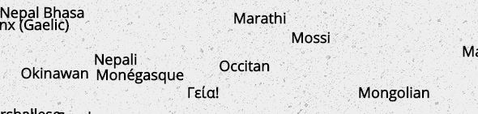

# wlcm



A pure javascript script to create word clouds!


```html
<section id="welcome"></section>
<script src="wlcm.js"></script>
<script>
		// container for wlcm
		let welcome = document.getElementById("welcome");

		// create wlcm object
		welcome.wlcm({
			"words": [
				"Hi!",
				"Hallo!",
				"Holla!",
				"Γεία!",
				"Bonjour!"
			]
		});
</script>
```